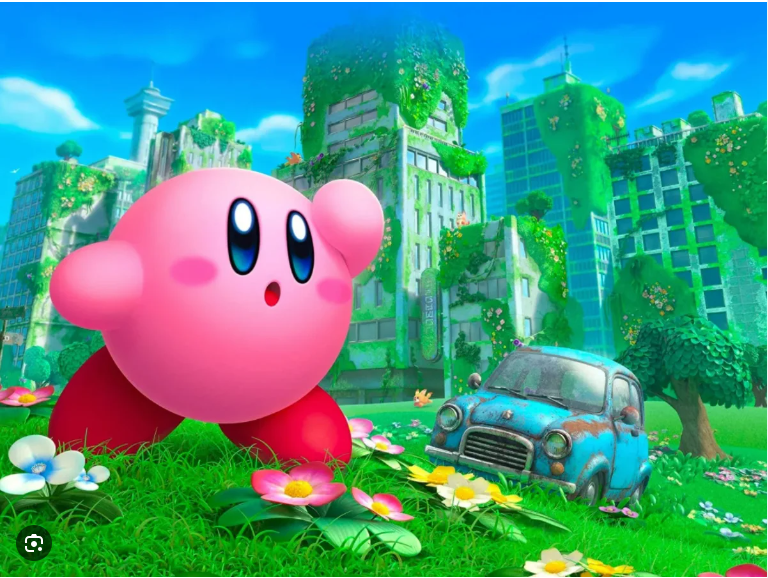
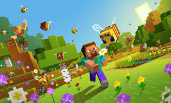
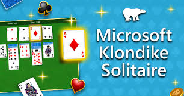
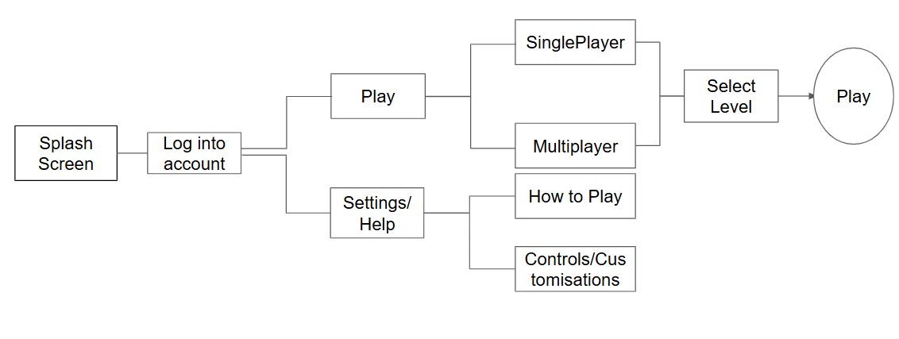

# Identifying and Defining
## Identifying a Need: 
My game has to be fun,entertaining and engaging for all ages, mainly targeting ages between 14-30. My age group normally loves action-paced games with a variety of options and selections. The game will require the user to navigate obstables to save characters. The main focus is to improve motors-skills and hand-eye coordination.It will follow a intriguing storyline and will include Easter Eggs. It will have various creatures and challenges which help to improve hand- eye coordination. It will have multiple tutorials and movement selections to ease difficulty for younger and older generation. This game will drag the user to be eager to play but not glue the user to the screen. Screen time will be limited by daily quests and points to protect the young ones from long-term eye problems and addicition. This simulation will accessible from all devices (mobile, PC, console). Some example include Kirby and Minecraft is a very fun and engaging games with a large audience of players ranging for all ages

## Requirements Outline:
- Inputs: The main controls for the simulation will be W,A,S,D and the arrow keys. For other devices, we will have additional controls being joysticks and tap to move. Secondary movement controls will be Shift for sprint, Spacebar for jumping and Tab for Inventory. The i,J,K,L keys will be to attack
- Processing: The program will check for the new position of the player and will update the score in the background. The program will check for collisions with buttons and enemies(interactive objects)
- Outputs: The game will display items and character selections. After the user dies it will display player sc with a game over message and statistics. Overtime, while the game is running, the program will update the player's position.
- Transmission: There will be a multiplayer allowing the user to play with family and friends. There will be servers will text-to-text or voice chat. If playing singleplayer there is no internet required but if playing multiplayer, internet is required to connect to a server.
- Storage: The project will store game progress, user settings, or other important information. It will update automatically throughout the game. Singleplayer and multiplayer servers will be saved on the cloud, Multiplayer servers will be available allowing user to play with family and friends

## Functional Requirements
### User Interaction
    - The character can be interacted by the use of W,A,S,D and Arrow keys and will move the character to the direct position. Other Mobile devices will use joysticks and buttons to move the character 
    -The use has the ability to move the character using W,A,S,D, Sprint using the Shift, Crouch using Ctrl, Tab for Inventory and Spacebar for Jumping. 
### Core Gameplay and Simulation Mechanics
    -The aim of the game is save characters and you can unlock the along the way
    -Using W,A,S,D to move around, Attacking by using I,J,K,L, Interacting with object by walking to it
### Scoring and Feedback
    - When the player dies, the game over screen plays showing the enemys killed, friends saved, last level and stars collected
    -There will a help menu in the lobby to assist with any problems (e.g. tutorial)
### Level Progression or Simulation stages
    - The player will move onto the next using a next level stage. There will be a star you can ride to access a secret stage
    - To activate the next level poratl, you must walk towards it.
    - The program will automaticly save statistic on each level, but once you have enter the next level portal you can't return
### Saving and Loading Data
    - The data will be saved locally on the cloud. there are up to three saved avaliable for use
    - The game will automaticaly save all items. if you have already entered a level it will not save the position of the player
    - The game will come up with one of three loading screens
## Non-Functional Requirements
### Performance Requirements
    - The game should have average graphics able to run the game smoothly and compatible for the selected device. For gamers there should be better graphics frames and more sensitivity.
    - all the controls should activate as directed and should run smoothly
    - The game should not take too long to load, if it is need to take a long time, the loading screen should have some entertainment to keep the user distract for a while     until the game has fully loaded
### Usability requirements
    - The game has to be very easy to understand for the player
    - There will be a tutorial at the start of the game. At any point of time, you can access the settings for different types of tutorial
    - Waddle Dees' in Science coats will be accessible to talk to for any help, they can also give clues
### Comapbility requirements
    -The game must be able to run on multiple platforms (mobile,PC,console)
    -There will be servers for mutilplayer
    -The controls will adapt to the type of platform running the game

## Consideration of Social and Ethical Issues

Equity: The term refers to the absence of unfair, avoidable or remediable differences betwen groups of people, wheter the groups are defined socially,economically, demographically or geographically or other aspects of inequality(e.g. disability, gender, ethinicity). Equity refers to achieving equal outcomes, looking after indiviuals and communities with equity

Acessibilty: The term refers to the creating an inclusive society where everyone can participate fully, regardless of their abilities. By designing spaces, services, and products with accessibility in mind, we can ensure that people with disabilities have equal access to the world around them.

### Accessibilty
    My game will be accessible by poeple of all abilities. there will be compatiabilty options in the seeting for people with disabilities. Our game vstrives to bring a big audience in so we will make sure it is as accessib;e as cam be. There will be subtitles

### Privacy and Data Protection
    My game will collect every update of the user. It will be stored on a the cloud and to access it you have to enter in your account and password. If data is breached, we will try to retrieve it back, but if not possible there will be some kind of compesation
    
### Fairness and Representation
    My game will avoid sterotypes and bias by pre-generating the characters and item. You get to choose from a range of characters and will explore different biomes. Every enemy will have a selected amount of health/hits before it dies. The Charcters will be kid-friendly and gender neutral.

### Mental and Emotional Well-Being
    My game is ressured to help aid users' mental health. It is meant to be played with family and friend and help teamwork/collaboration skills. It helps gamers with there hand-eye coordination with intrugiung storyline and epic battles. it will be kid-friendly so PG and will have tutorials to help the user get used to the game.

### Cultural Sensitivities
    This game will have no relationship to any cultures. If it does happen to include any culture references, we will make sure that we support the culture with a positive attitude.

# Researching and Planning
## PMI Table

| Existing Ideas |Image of Game| Positive | Negative | Implementation | 
| --- | --- | --- | --- | --- |
| 1. Kirby |   |The game is fun and engaging, draws attention to a wide audience, mainly directed at gamers and has an intresting storyline| The game can be very addictive and can be very confusing to play|The game includes a lot of secrets, extra/bonus levels, fun boss and miniboss fights, wide variety of creatures and character selection|
| 2.Minecraft |  |The game is very fun and engaging, has different types of mobs and blocks, up to your creativity and different gamemodes |The game can be confusing for new players, prose addiction problem and it cost money|The game includes different biomes/dimension, out of the world boss fights and automated machines |
| 3.Solitaire|  | A classic game great for the elder generation, singleplayer game, interesting and fun game and skill/IQ based game| The game can be confusing for the newer generation, shorter attention span for the game and not a lot of revenue | It is a card game with different types of gamemodes (pyramid, Klondike) |

## PsuedoCode
### Movement:

#### &nbsp;  Begin Movement

#### &nbsp; &nbsp; &nbsp; &nbsp; Input userInput

#### &nbsp; &nbsp; &nbsp; &nbsp; IF 'A' Pressed THEN

#### &nbsp; &nbsp; &nbsp; &nbsp; &nbsp; &nbsp; &nbsp; &nbsp; &nbsp; &nbsp; Move player left

#### &nbsp; &nbsp; &nbsp; &nbsp; Else IF 'D' pressed THEN

#### &nbsp; &nbsp; &nbsp; &nbsp; &nbsp; &nbsp; &nbsp; &nbsp; &nbsp; &nbsp; Move player right

#### &nbsp; &nbsp; &nbsp; &nbsp; Else IF 'W' pressed THEN

#### &nbsp; &nbsp; &nbsp; &nbsp; &nbsp; &nbsp; &nbsp; &nbsp; &nbsp; &nbsp; Move player forward

#### &nbsp; &nbsp; &nbsp; &nbsp; Else IF 'S' pressed THEN

#### &nbsp; &nbsp; &nbsp; &nbsp; &nbsp; &nbsp; &nbsp; &nbsp; &nbsp; &nbsp; Move player backward

#### &nbsp; &nbsp; &nbsp; &nbsp; End Movement

### Movement Advanced:

#### &nbsp;  Begin Movement

#### &nbsp; &nbsp; &nbsp; &nbsp; Input userInput

#### &nbsp; &nbsp; &nbsp; &nbsp; While 'W' pressed 

#### &nbsp; &nbsp; &nbsp; &nbsp; IF 'Shift' pressed Then

#### &nbsp; &nbsp; &nbsp; &nbsp; &nbsp; &nbsp; &nbsp; &nbsp; &nbsp; &nbsp; Move player faster

#### &nbsp; &nbsp; &nbsp; &nbsp; Else IF 'Ctrl' pressed THEN

#### &nbsp; &nbsp; &nbsp; &nbsp; &nbsp; &nbsp; &nbsp; &nbsp; &nbsp; &nbsp; Crouch player

#### &nbsp; &nbsp; &nbsp; &nbsp; Else IF 'Spacebar' pressed THEN

#### &nbsp; &nbsp; &nbsp; &nbsp; &nbsp; &nbsp; &nbsp; &nbsp; &nbsp; &nbsp; Jump player

#### &nbsp; &nbsp; &nbsp; &nbsp; End Movement Advanced

## Level Progession

#### &nbsp;  Begin Next Level

#### &nbsp; &nbsp; &nbsp; Input userInput

#### &nbsp; &nbsp; &nbsp; If player touches 'Next Level Portal

#### &nbsp; &nbsp; &nbsp; &nbsp; &nbsp; &nbsp; &nbsp; Simulate Next Level

#### &nbsp; &nbsp; &nbsp; Elif player touches 'Secret Level Portal"

#### &nbsp; &nbsp; &nbsp; &nbsp; &nbsp; &nbsp; &nbsp; Simulate Secret Level 

#### &nbsp; End Next Level

## Scoring and Feedback

#### &nbsp;  Begin Scoring and Feedback

#### &nbsp; &nbsp; &nbsp; If player DIES

#### &nbsp; &nbsp; &nbsp; &nbsp; &nbsp; &nbsp; &nbsp; Show GameOver Screen

#### &nbsp; &nbsp; &nbsp; &nbsp; &nbsp; &nbsp; &nbsp; IF Show Player Achievements and Highscores

#### &nbsp; &nbsp; &nbsp; &nbsp; &nbsp; &nbsp; &nbsp; Show Player Achievements and Highscores

#### &nbsp; &nbsp; End

## Saving and Loading
#### &nbsp; &nbsp; Begin Saving and Loading

#### &nbsp; &nbsp; &nbsp; userInput

#### &nbsp; &nbsp; &nbsp; Input SplashScreen

#### &nbsp; &nbsp; &nbsp; While SplashScreen is active

#### &nbsp; &nbsp; &nbsp; IF USer Is Commected To Internet

#### &nbsp; &nbsp; &nbsp; &nbsp; &nbsp; &nbsp; &nbsp; IF User Opens One of Three saves

#### &nbsp; &nbsp; &nbsp; &nbsp; &nbsp; &nbsp; &nbsp; &nbsp; &nbsp; &nbsp; &nbsp; &nbsp; Load Data

#### &nbsp; &nbsp; &nbsp; &nbsp; &nbsp; &nbsp; &nbsp; IF User Access Tutorial

#### &nbsp; &nbsp; &nbsp; &nbsp; &nbsp; &nbsp; &nbsp; &nbsp; &nbsp; &nbsp; &nbsp; &nbsp; Load Tutorial

#### &nbsp; &nbsp; &nbsp; &nbsp; &nbsp; &nbsp; &nbsp; IF User Connects To Multiplayer Servers

#### &nbsp; &nbsp; &nbsp; &nbsp; &nbsp; &nbsp; &nbsp; &nbsp; &nbsp; &nbsp; &nbsp; &nbsp; Load Multiplayer Servers

## FlowChart
### Movement

### Movement Advanced

### Level Progression 

### Scoring and Feedback

### Saving and Loading

## StoryBoards

### Splash Screen

### Mode Selection

### Level Selection

### Example Level

## Gantt Chart

